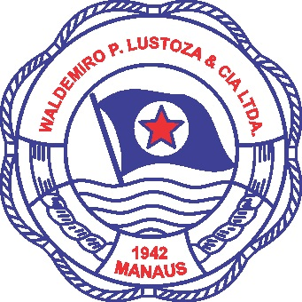

# Description
Sigwpl is a web application that I have been developing since 2016 for HelpAmazon company as a Freelancer. This project controls departments of a vessel company called Waldemiro P. Luztoza & Cia Ltda in Brazil such as maintenance, finances, human resources and others.

I have been working in the entire process of developing i.e.:
 - Collect requirements; 
 - Planning;
 - Prototyping;
 - Implementation; 
 - Testing;
 - Deployment.

This project provided me a solid understanding of full-stack development and project management.

# Project Structure
MVC design pattern (Model-View-Controller)

