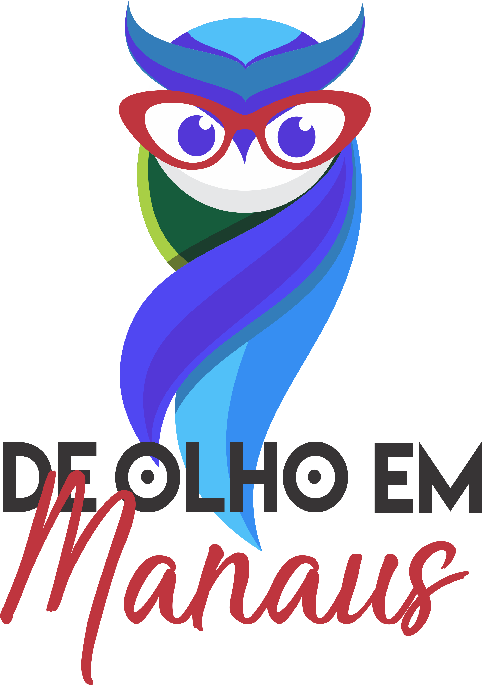

# Description
“De olho em manaus” is a mobile application that I developed in 2017. The project helped me to learn more about design and differents features for Android SO.

At the beginning of the project I hosted my database in AmazonWS where the data was consumed through JSON. However, I changed to Firebase service after 1 year and shutted down AWS. 

 <a href="https://play.google.com/store/apps/details?id=br.com.atadigital.guiamanaus&hl=pt_BR">
  

