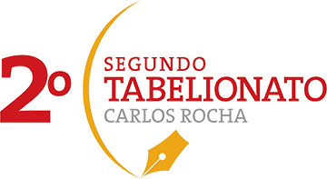

# Description

It was my first professional project in web development that I helped to developer in the [Buritech](https://www.facebook.com/buritech/) company. This project control the entire process of a registry in the notary's office (notary public).

This project provided me a solid understanding of a professional project.

# Project Structure
MVC design pattern (Model-View-Controller)
