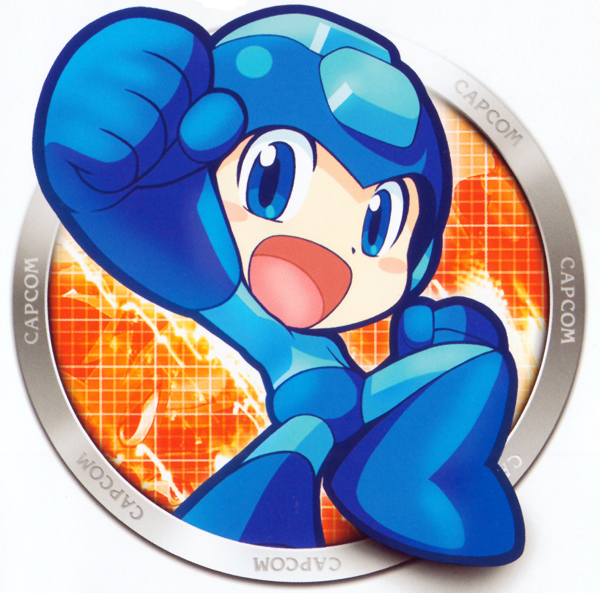

# Description
It was my first Game project which helped me to realise how is to develop a game.

In this game you just need jump or slash to avoid obstacles. 

# Project Structure
MVC design pattern (Model-View-Controller)

# Download
https://drive.google.com/open?id=1TOM3BvkG3VZtOZYQVr632LA7fYIBuxct
