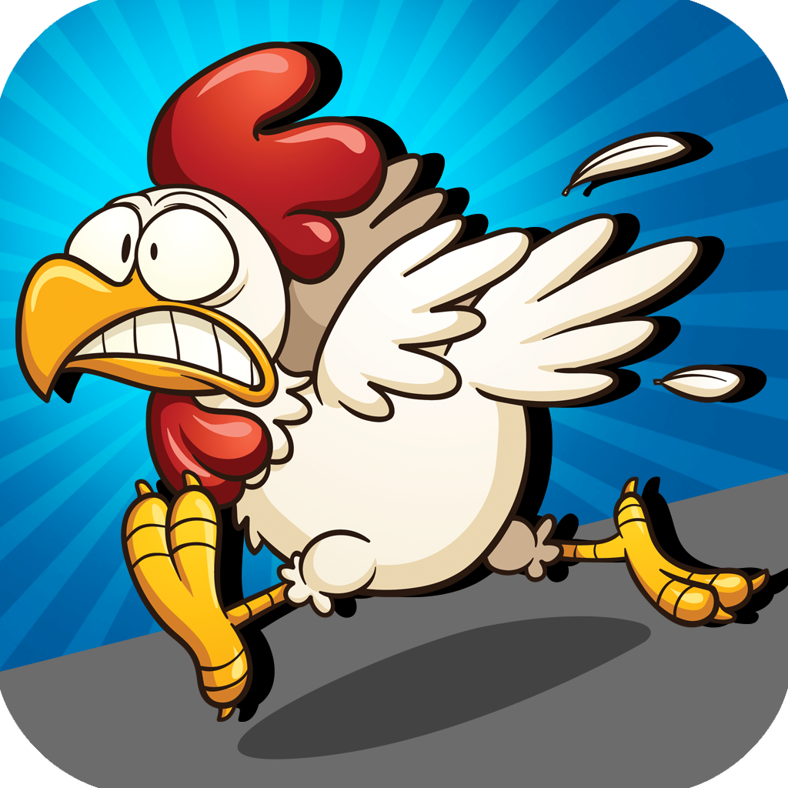

# Description
It was a game that a develop through the course CrossyRoad3D. Which means, I had opportunity to learn with a professional about how to start a develop a game, such as MagicaVoxel and Blender to model Assets and how to develop procedural scenarios. There are some bugs in the project but you are able to play :P

# Project Structure
MVC design pattern (Model-View-Controller)

# Download
https://drive.google.com/open?id=1TOM3BvkG3VZtOZYQVr632LA7fYIBuxct
